DCOM
====

Many legacy management tools are powered by DCOM (Distributed Component Object Model). The Microsoft DCOM uses MSRPC which is based on DCE/RPC.

RPC uses TCP ports 135 and 445 (SMB for named pipes). It may use other ports also. See the article: [Service overview and network port requirements for Windows](https://support.microsoft.com/en-us/help/832017/service-overview-and-network-port-requirements-for-windows#method38)

Start Computer Management in Domain
-----------------------------------

You may start Computer Management from Server Manager.


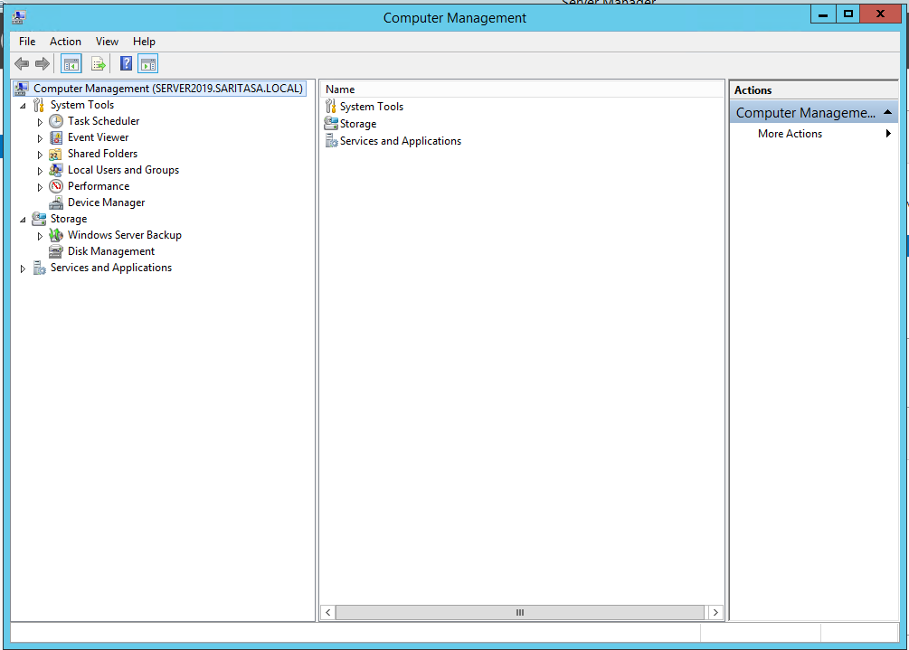

Start Computer Management in Workgroup
--------------------------------------

Our workgroup PC does not know about Active Directory DNS. We'll add a hostname to the hosts file.

```powershell
Add-Content -Encoding UTF8 "$($env:windir)\system32\Drivers\etc\hosts" '192.168.11.137 server2019.saritasa.local'
```

We can't connect to domain servers from a workgroup PC directly. DCOM uses network level authentication. Process needs to have a correct user identity. We'll use the `runas` tool, it requires administrator permissions.

```powershell
runas /user:anton@saritasa.local /netonly "mmc compmgmt.msc /computer:server2019.saritasa.local"
```

```powershell
PS C:\Users\anton> Add-Content -Encoding UTF8 "$($env:windir)\system32\Drivers\etc\hosts" '192.168.11.137 server2019.saritasa.local'
PS C:\Users\anton> runas /user:anton@saritasa.local /netonly "mmc compmgmt.msc /computer:server2019.saritasa.local"
Enter the password for anton@saritasa.local:
Attempting to start mmc compmgmt.msc /computer:server2019.saritasa.local as user "anton@saritasa.local" ...
```

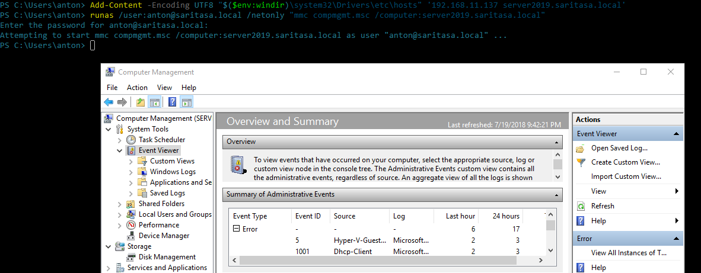

We connected to a domain server. We also can connect to a workgroup server with different administrator credentials.

```powershell
runas /user:administrator /netonly "mmc compmgmt.msc /computer:hyper1"
```

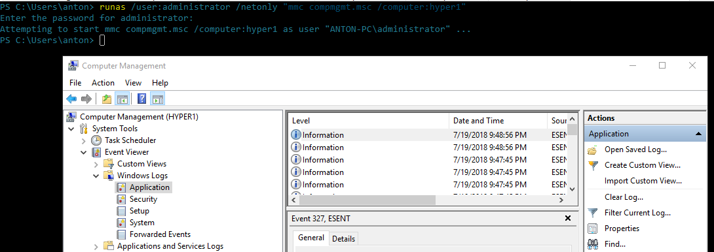

Start MMC in Domain
-------------------

Start MMC, add a snap-in and connect to another server in domain.

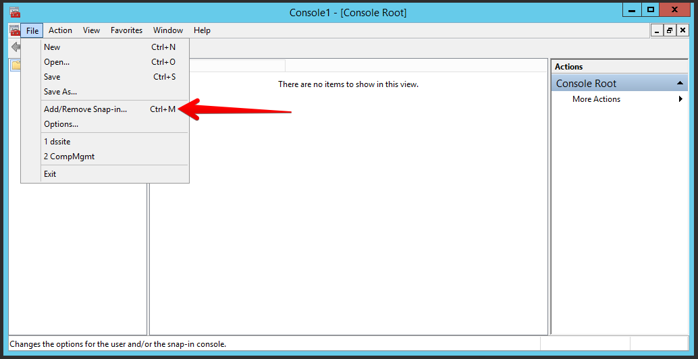

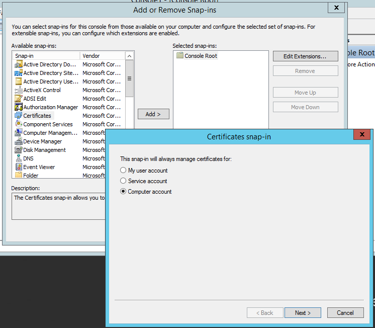

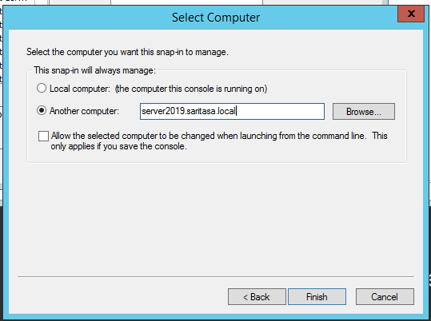

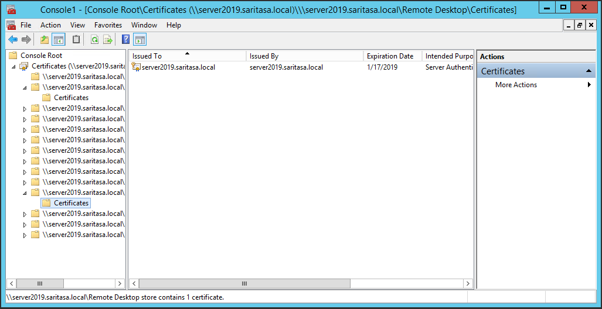

You may also run a snap-in from command line:

```powershell
compmgmt.msc /computer:server2019.saritasa.local
```


See [the list of the most common MMC commands](https://social.technet.microsoft.com/Forums/windowsserver/en-US/61b864f4-2b04-44a1-88dc-86fae0a8d592/the-most-usefull-active-directory-mmc-run-commands). You may also find MMC commands in file system:

```powershell
gci C:\windows\System32\*.msc | select name
```

You may save MMC console to file to quickly open necessary snap-ins later.

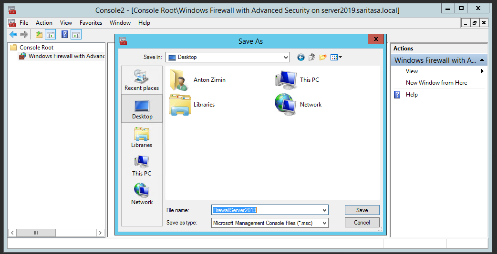

Firewall Configuration
----------------------

An error is shown if firewall rules are not configured.

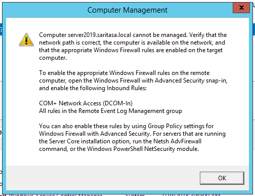

Connect to the target server by WinRM. Execute following command to enable firewall rules for computer management:

```powershell
Set-NetFirewallRule -DisplayGroup 'Remote Event Log Management' -Enabled True -PassThru | select DisplayName
```

Example:

```powershell
[server2019.saritasa.local]: PS C:\Users\anton\Documents> Set-NetFirewallRule -DisplayGroup 'Remote Event Log Management' -Enabled True -PassThru | select DisplayName

DisplayName
-----------
Remote Event Log Management (RPC)
Remote Event Log Management (RPC-EPMAP)
Remote Event Log Management (NP-In)
```

Rule                                    | Port                | Description
--------------------------------------- | ------------------- | ---------------------------------------
Remote Event Log Management (NP-In)     | TCP: 445            | Inbound rule for the local Event Log service to be remotely managed over Named Pipes.
Remote Event Log Management (RPC)       | RPC Dynamic Ports   | Inbound rule for the local Event Log service to be remotely managed via RPC/TCP.
Remote Event Log Management (RPC-EPMAP) | RPC Endpoint Mapper | Inbound rule for the RPCSS service to allow RPC/TCP traffic for the local Event Log Service.

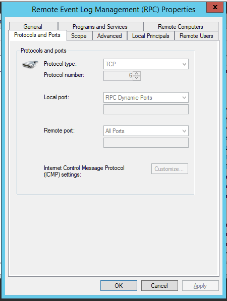

The `Remote Event Log Management` group controls access to following services:

- Event Viewer
- Shared Folders
- Local Users and Groups
- Performance Monitor
- Services

Actually, there are different rules, but they use the same RPC ports. Read the article for details: [How to Enable Remote Administration of Server Core via MMC using NETSH](https://blogs.technet.microsoft.com/askds/2008/06/05/how-to-enable-remote-administration-of-server-core-via-mmc-using-netsh/)

Firewall management is also protected. Let's find rules to enable:

```powershell
Get-NetFirewallRule | ? { $_.DisplayName -like '*firewall*' }
```

```powershell
Set-NetFirewallRule -DisplayGroup 'Windows Defender Firewall Remote Management' -Enabled True -PassThru | select DisplayName
```

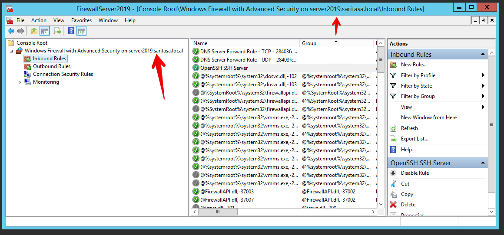

Performance Monitor
-------------------

Run perfmon directly in domain or use `runas /netonly` in workgroup. Need to set computer explicily in `Add Counters` window.

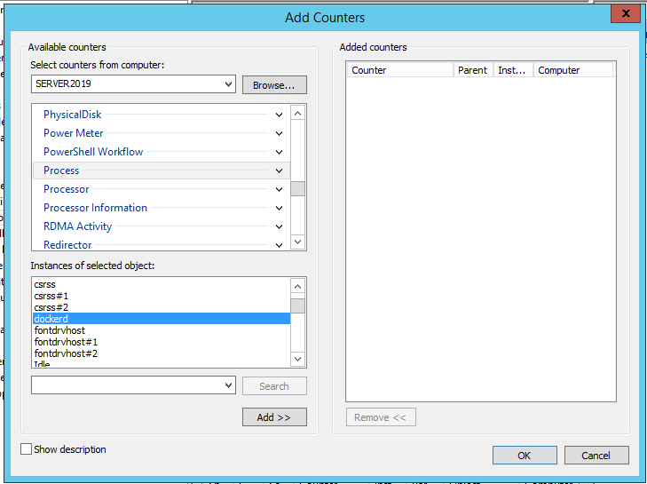
