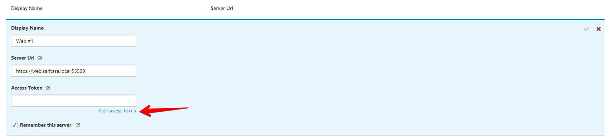
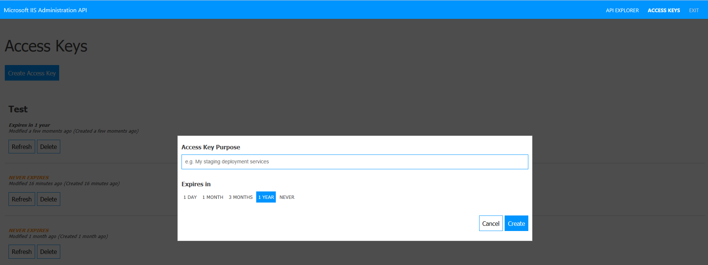
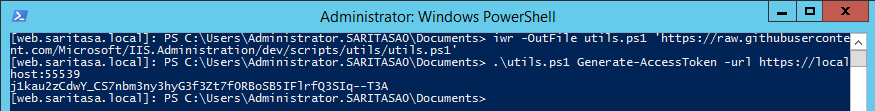
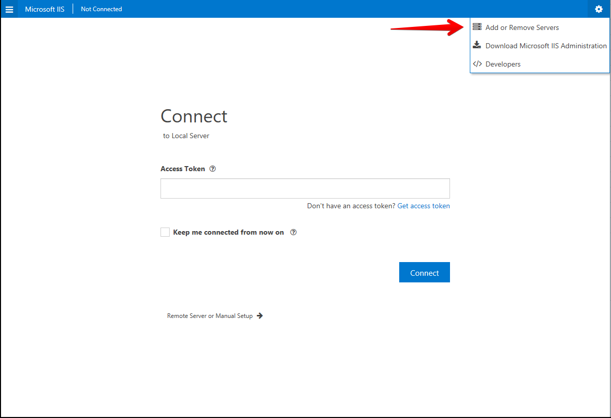
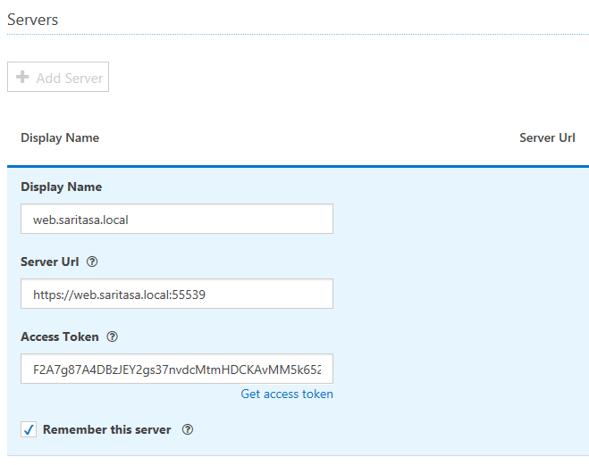
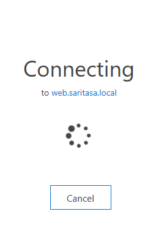
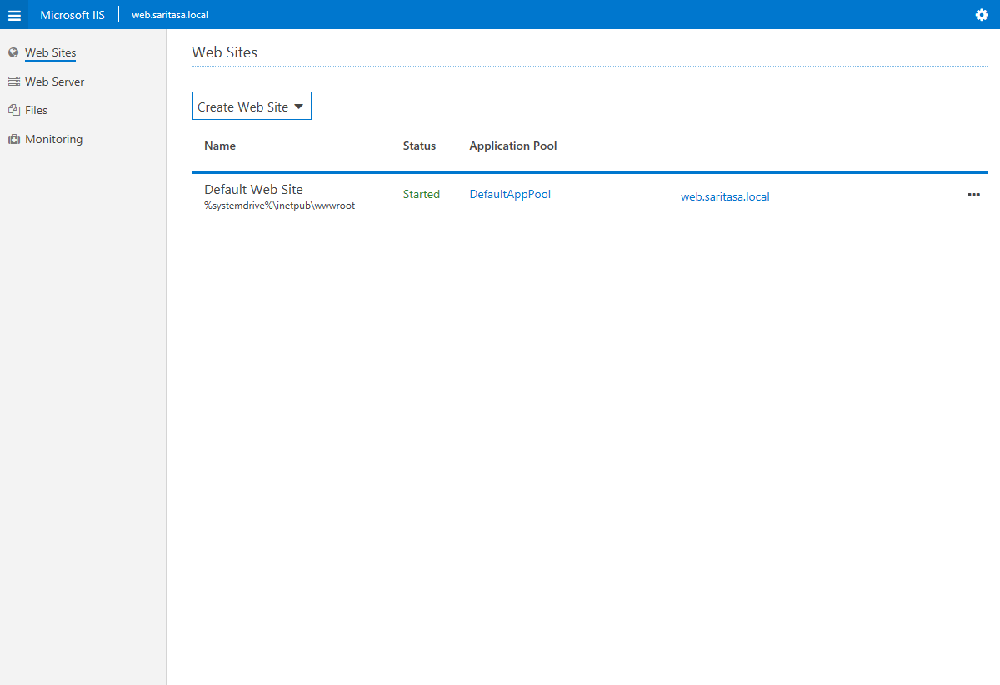
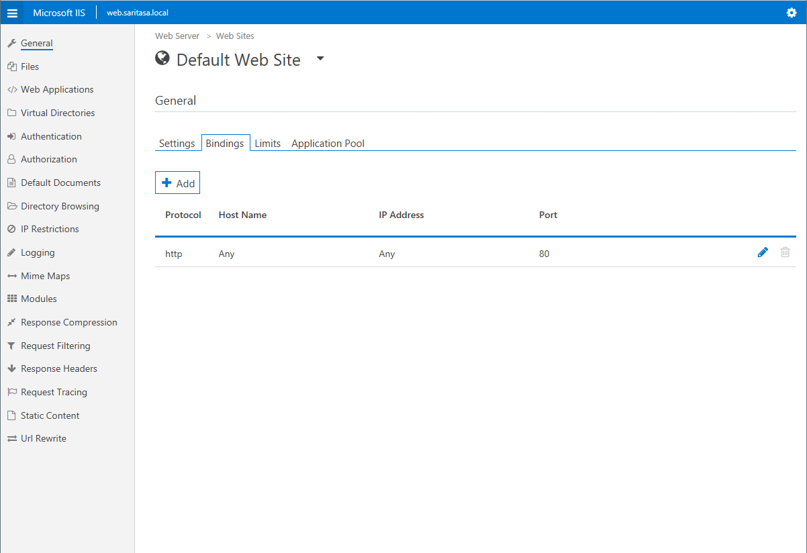
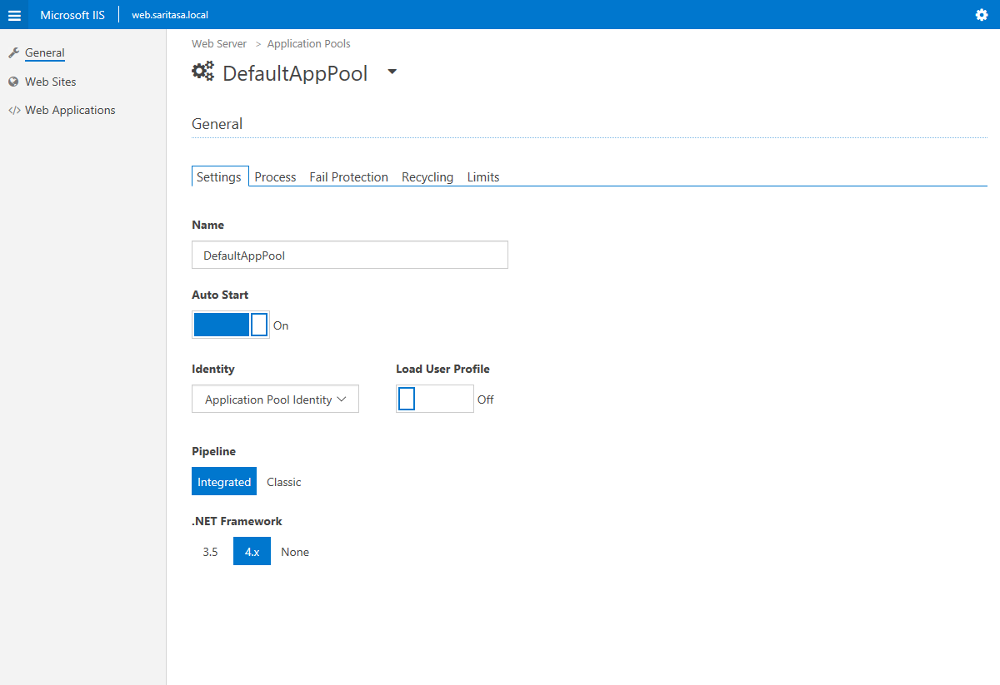

IIS Administration
==================

[IIS Administration](https://docs.microsoft.com/en-us/iis-administration/) is a modern REST API to manage IIS. It's [open source](https://github.com/Microsoft/IIS.Administration) software. Default port is 55539.

Installation
------------

[Install](https://docs.microsoft.com/en-us/iis-administration/getting-started) it to server.

Create firewall rule:

```powershell
New-NetFirewallRule -DisplayName 'IIS Administration' -Action Allow -Direction Inbound -LocalPort 55539 -Protocol TCP
```

Generate Token in Portal
------------------------

Open <https://manage.iis.net/> web site. Try to add a new server. Enter URL and click `Get access token`.



You'll be redirected to your server (for example <https://web.saritasa.local:55539/security/tokens>). Enter administrator credentials. Create a new token.



Generate Token using PowerShell
-------------------------------

```powershell
iwr -OutFile utils.ps1 'https://raw.githubusercontent.com/Microsoft/IIS.Administration/dev/scripts/utils/utils.ps1'
.\utils.ps1 Generate-AccessToken -url https://localhost:55539
```



If request fails, make sure the service is started:

```powershell
Get-Service 'Microsoft IIS Administration'
```

Make sure you generate user under the same account that was used during installation. You may see the user in config:

```powershell
cat 'C:\Program Files\IIS Administration\2.2.0\Microsoft.IIS.Administration\config\appsettings.config'
```

Usage
-----

Open <https://manage.iis.net/> web site. Add a server, enter access token.





Connect to server.



You'll be asked to enter administrator credentials. Windows authentication is enabled by default, you can [disable](https://github.com/Microsoft/IIS.Administration/issues/86#issuecomment-302260245) it.

Overview
--------

IIS Administration allows to manage web sites, web applications, app pools and some IIS modules.






