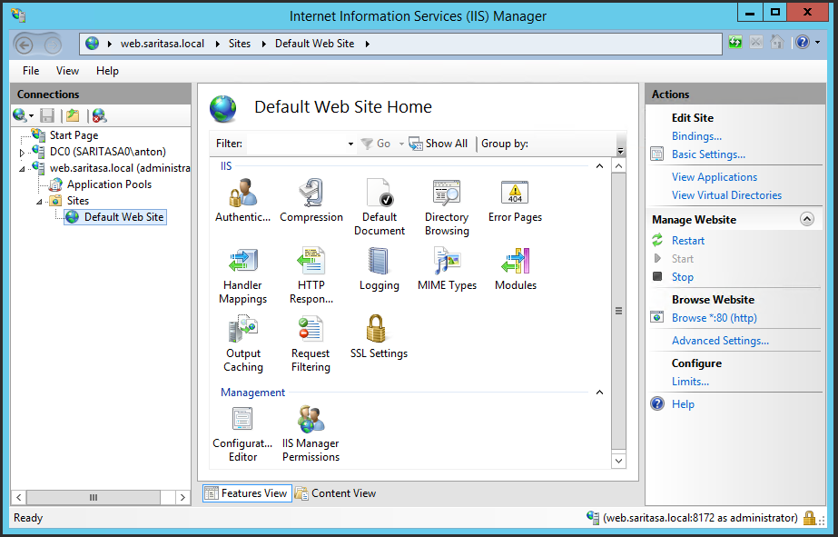
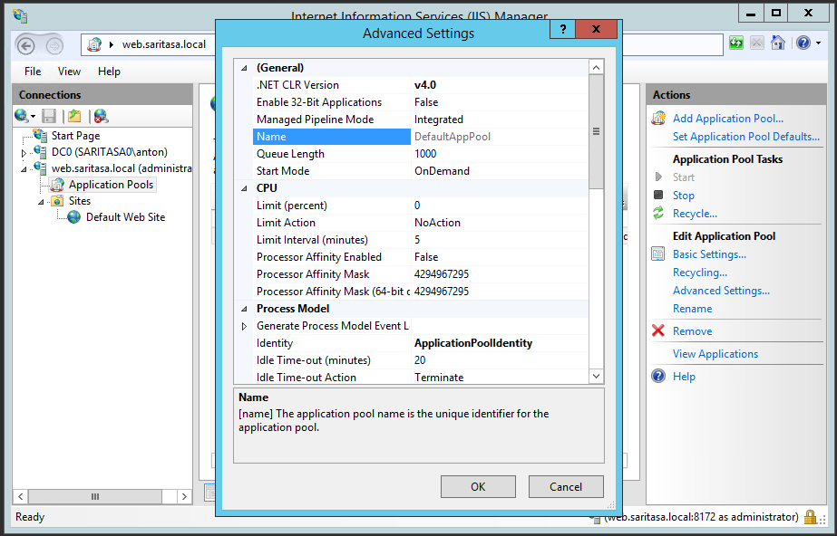
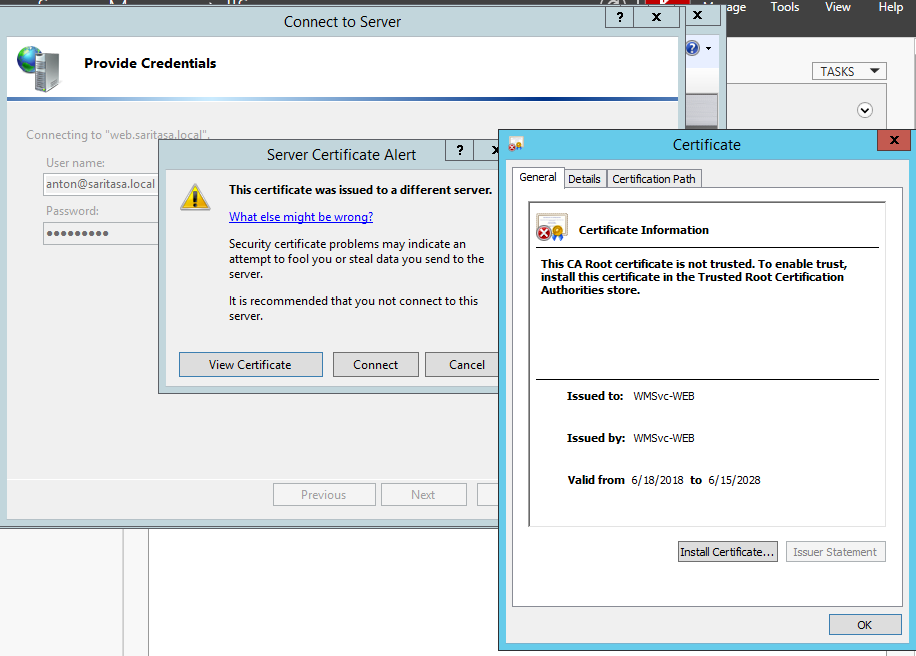

IIS Manager
===========

IIS Manager allows to manage local or remote IIS server. It works over SOAP-based protocol called [WS-Management](https://docs.microsoft.com/en-us/windows/desktop/winrm/ws-management-protocol). HTTPS endpoint runs on port 8172.

You may manage app pools, web sites, applications and global IIS settings. Actually it edits `applicationHost.config`, `web.config` and other XML files.





IIS Management Console
----------------------

Install it to local or management server.


```powershell
Add-WindowsFeature Web-Mgmt-Console
```

Management Service
------------------

Install it to enable remote IIS management.

Web Management Service requires configuration:
- Enable remote access in registry.
- Enable service autostart.
- Set correct SSL certificate for HTTPS endpoint.



It's easier to do everything using cmdlet from [Saritasa.RemoteManagement](https://www.powershellgallery.com/packages/Saritasa.RemoteManagement) module. For example:

```powershell
Install-Iis -ServerHost web.saritasa.local -ManagementService
```

```powershell
Install-WebManagementService
```

IIS Manager for Remote Administration
-------------------------------------

Install IIS Manager component of Windows 10.

```powershell
Enable-WindowsOptionalFeature -Online -FeatureName IIS-ManagementConsole -All
```

Install the [manager](https://www.iis.net/downloads/microsoft/iis-manager) to Windows 10.

