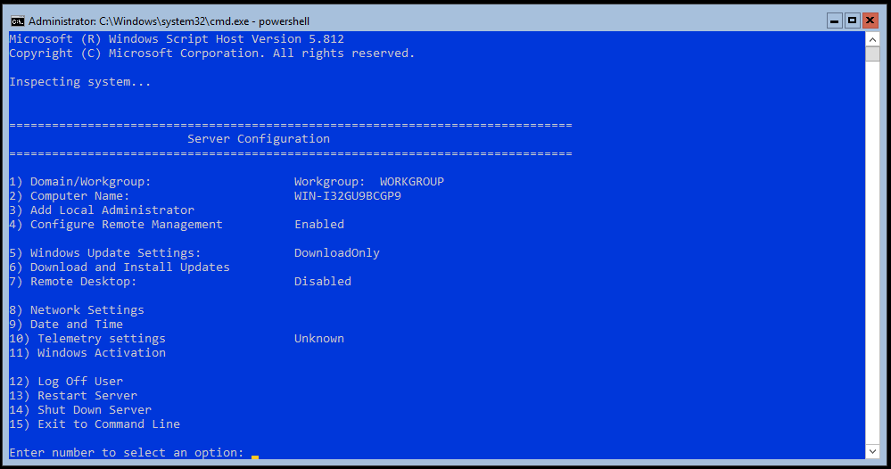
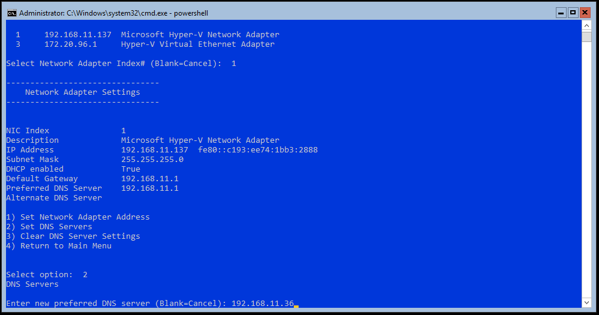

Server Configuration Tool
=========================

[Sconfig](https://docs.microsoft.com/en-us/windows-server/get-started/sconfig-on-ws2016) is a tool to configure basic settings on Windows Server Core without GUI.

Join Domain
-----------

Run Sconfig.

```powershell
sconfig
```



Open Network Settings (item #8). Change DNS servers to your domain controllers.



Join domain (#1), rename computer (#2). Restart server.

Enable WinRM
------------

Usually WinRM is enabled automatically in Server Core edition. You may use item #4 of to configure remote management.
