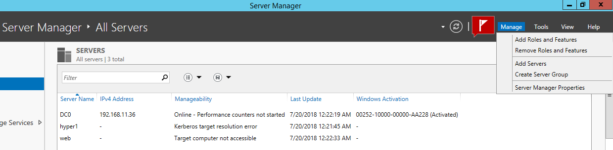
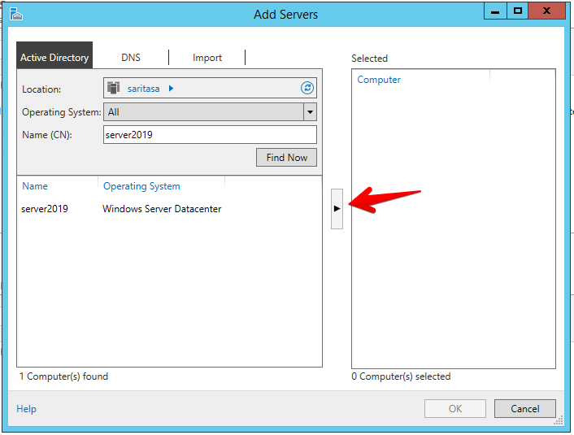
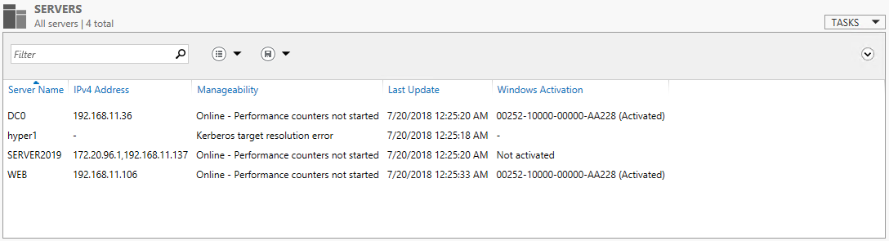
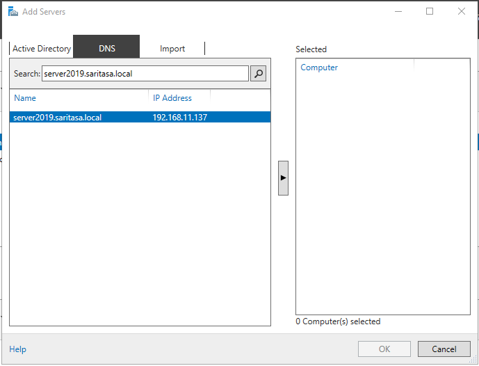
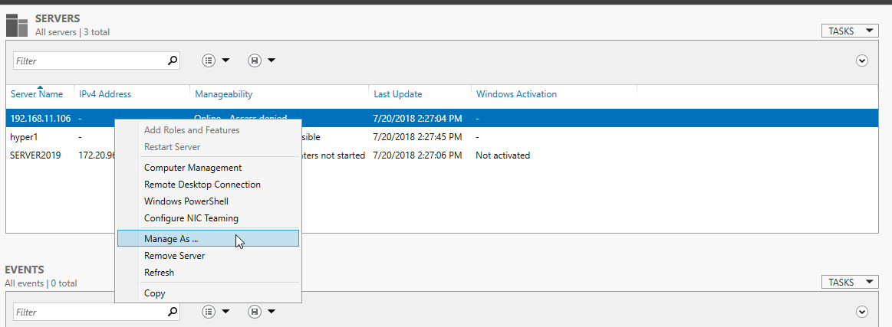
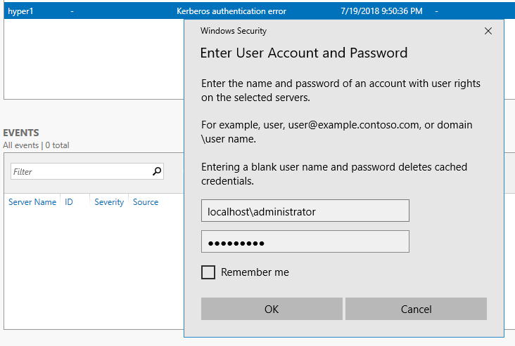
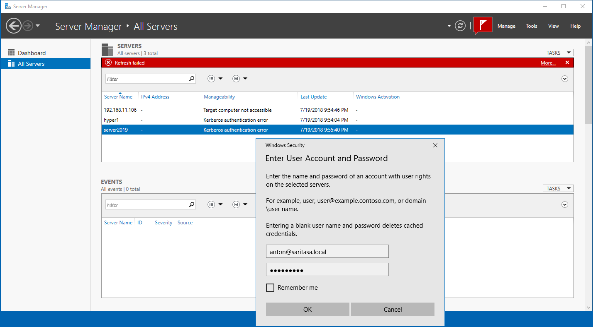
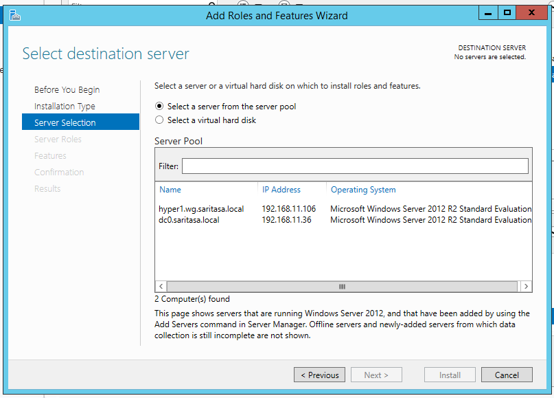
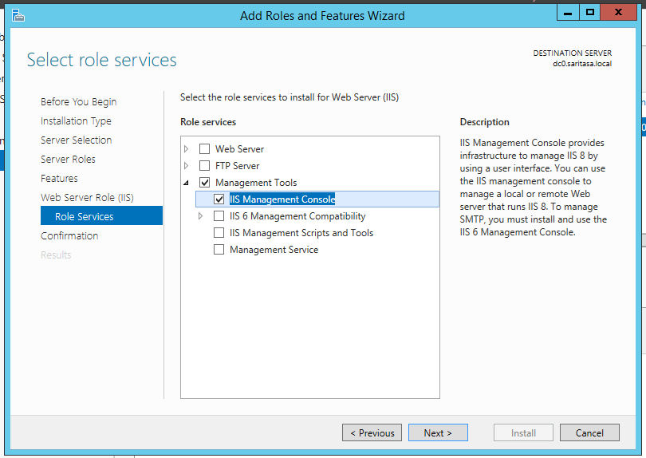
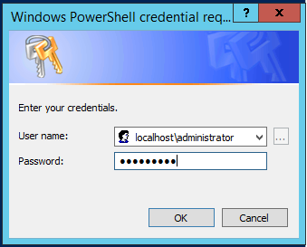

Server Manager
==============

Server Manager is preinstalled in Windows Server. You need to install [RSAT](https://www.microsoft.com/en-us/download/details.aspx?id=45520) for Windows 10.

Use in Domain
-------------

Open `Add Servers` dialog.



Search server in Active Directory, add it.





Use in Workgroup
----------------

You need to have PowerShell remoting enabled.

```powershell
Enable-PSRemoting
```

Every server needs to be added to trusted list. Make sure you network connection is secure (VPN or LAN).

```powershell
Set-Item WSMan:\localhost\Client\TrustedHosts web.saritasa.local -Concatenate -Force
```

Install [Remote Server Administration Tools (RSAT) for Windows 10](https://www.microsoft.com/en-us/download/details.aspx?id=45520).

Add server by hostname or IP address.



Use `Manage As` menu item to set administrator credentials.





You may use domain credentials also.



Install Software
----------------

Use `Manage` > `Add Roles and Features` menu item.





Manage Computer
---------------

Open `Computer Management` in context menu.

See the [DCOM](Dcom.md) article for details.

Start PowerShell Session
------------------------

Open `Windows PowerShell` in context menu. `Negotiate` authentication without SSL is used.

It will ask for credentials in workgroup.



See the [WinRM](WinRM.md) article for details.
