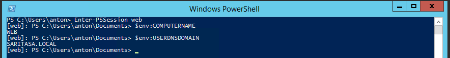
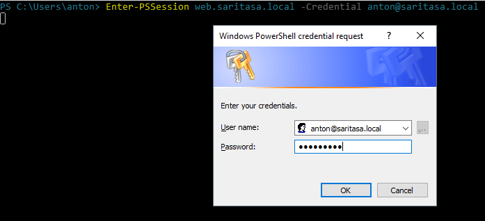
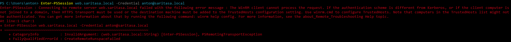
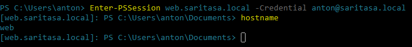
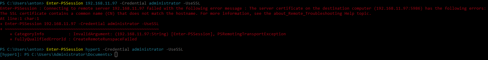

WinRM
=====

Windows Remote Management is powered by WS-Management protocol (Web Services for Management, WSMan). PowerShell Remoting works over WinRM.

WinRM uses TCP ports 5985 (HTTP) and 5986 (HTTPS).

Following SSPs (security support providers) are supported by WinRM:

- Kerberos
- NTLM
- Negotiate
- Basic
- Digest

Negotiate tries to set up Kerberos session firstly and falls back to NTLM.

Basic and Digest are HTTP authentication methods. They are not encrypted and require SSL for security.

NTLM session is encrypted, but server identity can not be verified. That's why NTLM requires hostname to be added to a trust list. A hacker can potentially steal NTLM hash and find a password for it.

All connections inside domain are encrypted, they use Kerberos network level authentication.

Connection to workgroup server by NTLM should be protected by HTTPS.

Set up WinRM
------------

WinRM is enabled by default in Server Core.

Read the article about WinRM configuration: [Installation and Configuration for Windows Remote Management](https://docs.microsoft.com/en-us/windows/desktop/winrm/installation-and-configuration-for-windows-remote-management)

If you want to quickly set up WinRM over HTTPS, read the [article](../WinRMConfiguration.md).

Start Session in Domain
-----------------------

```powershell
Enter-PSSession web
```



Start Session in Workgroup
--------------------------

```powershell
Enter-PSSession web.saritasa.local -Credential anton@saritasa.local
```



NTLM authentication is not safe without SSL. Need to add a hostname to trusted list if you're confident about the server identity.



Run as administrator, then retry the connection:

```powershell
Set-Item WSMan:\localhost\Client\TrustedHosts web.saritasa.local -Concatenate -Force
```



Connect by HTTPS
----------------

- Make sure HTTPS for WinRM is enabled and valid certificate is selected. You may set up configuration with self-signed certificate using [the instruction](../WinRMConfiguration.md).
- Connect to server using the hostname which is mentioned in the certificate.
- The certificate authority must be added to the trusted list on your PC.

```powershell
PS C:\Users\anton> Enter-PSSession hyper1 -Credential administrator -UseSSL
[hyper1]: PS C:\Users\Administrator\Documents>
```



Here's how you can add a self-signed certificate to the trusted list:

```powershell
Install-Module Saritasa.Web -Force
Import-TrustedSslCertificate hyper1.wg.saritasa.local -Port 5986
```
