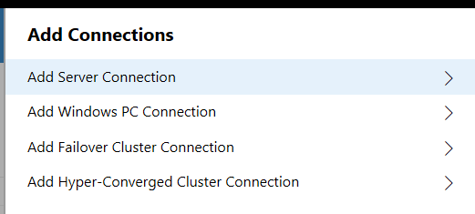
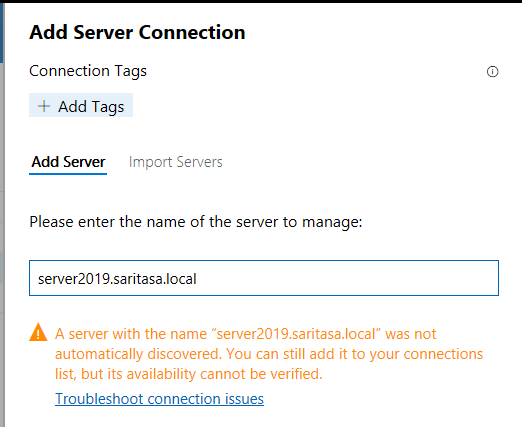
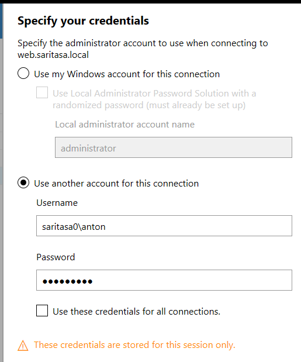
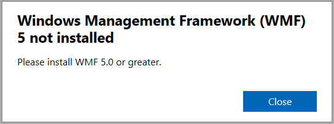
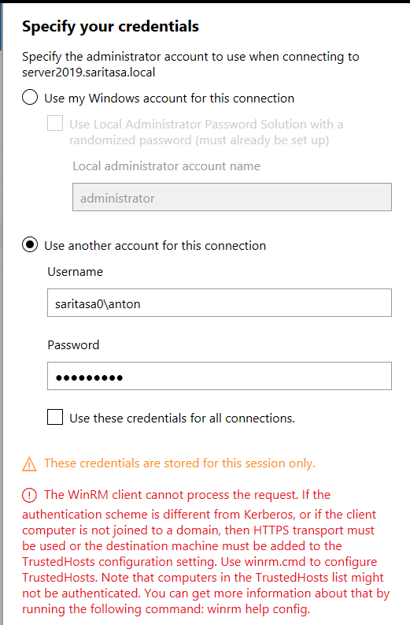
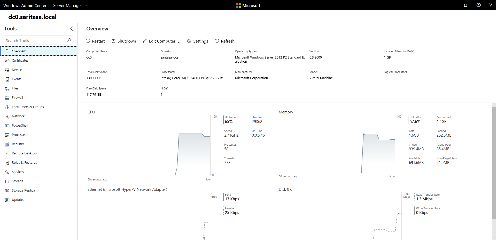
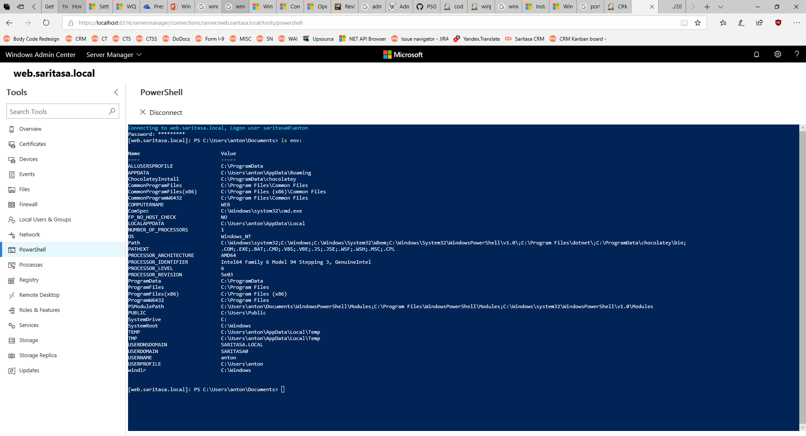
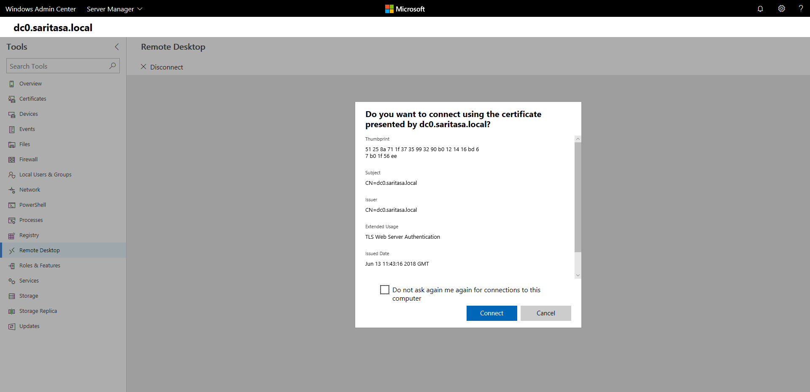
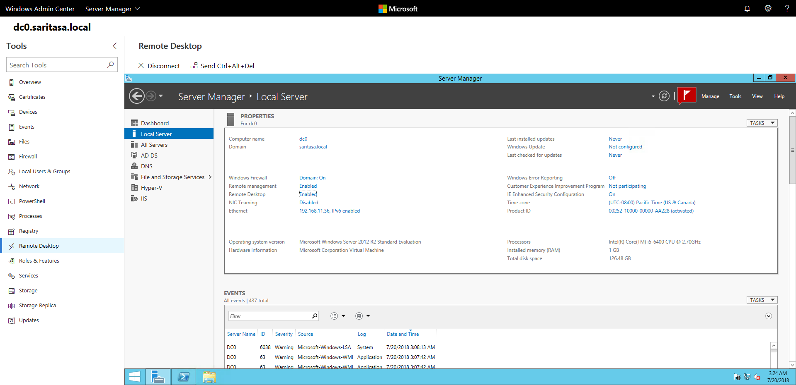

Windows Admin Center
====================

[Windows Admin Center](https://docs.microsoft.com/en-us/windows-server/manage/windows-admin-center/overview) is a web panel to administer Windows Server. It can be installed in [2 modes](https://docs.microsoft.com/en-us/windows-server/manage/windows-admin-center/deploy/install):
- Desktop (Windows 10)
- Gateway (Windows Server)

Desktop mode allows to manage many servers from different networks and domains.
Gateway mode is good to manage all domain servers from any PC, even without Windows.

Manage Server in Domain
-----------------------

Add a server to list and click `Connect`. `Kerberos` authentication is used to connect servers by WinRM protocol.

Manage Server in Workgroup
--------------------------

Add a new server connection:



Enter hostname. Automatic connection may work in workgroup if your NTLM account is valid on target server and hostname is added to trusted list. Usually different accounts are used and a warning is displayed.



Select server in list, click `Manage As` button. Enter credentials. It's better to use `domain\user` form instead of `user@domain` here because of a bug with PowerShell connection in Admin Center.



If target server does not have WMF 5, need to install it.



```powershell
# Install Chocolatey.
Set-ExecutionPolicy Bypass -Scope Process -Force; iex ((New-Object System.Net.WebClient).DownloadString('https://chocolatey.org/install.ps1'))
# Install WMF 5.1 and PowerShell 5.1.
cinst powershell -y
Restart-Server
```

If WAC is installed on a PC inside workgroup, NTLM authentication is used to connect to workgroup or domain servers.



If your network is secure (VPN), add target server name to trusted hosts.

```powershell
Set-Item WSMan:\localhost\Client\TrustedHosts hyper1.wg.saritasa.local -Concatenate -Force
```

WAC does not support WinRM over HTTPS. If network is public, you should install WAC in gateway mode.

Overview
--------

Windows Admin Center is not a replacement for traditional management tools, but it has many good features.



PowerShell
----------

Open PowerShell console in Windows Admin Center:



RDP
---

RDP client is available inside browser window.




