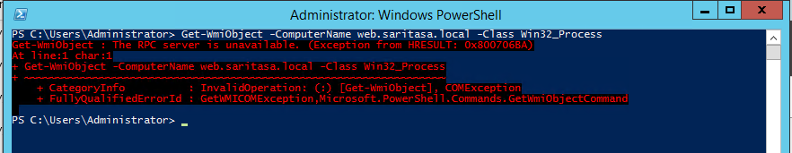

WMI
===

WMI (Windows Managed Infrastructure) works over DCOM. CIM (Common Information Model) works over SOAP, it's based on the WS-Management standard.

- [Windows Management Instrumentation](https://docs.microsoft.com/en-us/windows/desktop/wmisdk/wmi-start-page)
- [Win32 Provider](https://docs.microsoft.com/en-us/windows/desktop/CIMWin32Prov/win32-provider)

WMI is used for many sensors in PRTG monitoring software.

Get WMI Object Remotely
-----------------------

Execute statement:

```powershell
Get-WmiObject Win32_Process -ComputerName server2019.saritasa.local
```

It returns list of objects from remote server if firewall rules are set up correctly.

If RPC error is returned, you need to enable the WMI firewall group on the target server.



```powershell
Set-NetFirewallRule -DisplayGroup 'Windows Management Instrumentation (WMI)' -Enabled True
```

Get CIM Object Remotely
-----------------------

CIM uses the same classes as WMI, but runs over WinRM.

```powershell
PS C:\Users\anton> Get-CimInstance Win32_OperatingSystem -ComputerName server2019

SystemDirectory   Organization     BuildNumber      RegisteredUser   SerialNumber     Version          PSComputerName
---------------   ------------     -----------      --------------   ------------     -------          --------------
C:\Windows\sys...                  17666                             00395-60000-0... 10.0.17666       server2019
```

If you need to use HTTPS, use `New-CimSession` and `New-CimSessionOption` cmdlets.

Queries
-------

WMI supports [WQL](https://docs.microsoft.com/en-us/windows/desktop/WmiSdk/wql-sql-for-wmi) query language.

```powershell
PS C:\Users\anton> Get-CimInstance Win32_Volume -Filter "Caption = 'C:\\' OR DeviceID LIKE '%d77cde96%'" | select DriveL
etter

DriveLetter
-----------
C:
D:
```
